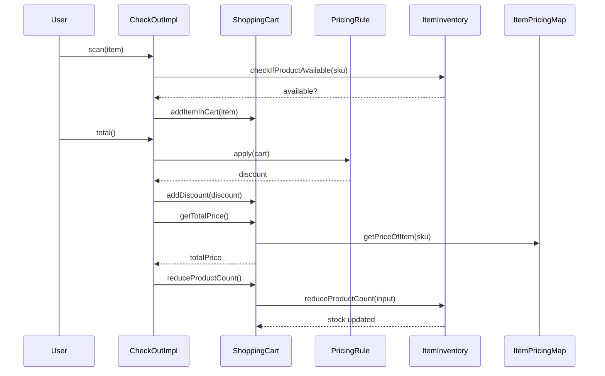

# Checkout-BE Module Documentation

## Introduction and Purpose

The **Checkout-BE** module implements the backend logic for a retail checkout system. It manages shopping cart operations, applies pricing rules (including discounts and promotions), checks inventory, and calculates the final total for a customer's purchase. The module is designed for extensibility, allowing new pricing rules and inventory management strategies to be added with minimal changes.

## Architecture Overview

The Checkout-BE module is composed of several core sub-modules:
- **Checkout Process**: Handles the main checkout workflow, including scanning items and calculating totals.
- **Shopping Cart**: Manages the items selected by the customer and tracks quantities, prices, and discounts.
- **Inventory Management**: Maintains product stock levels and validates availability.
- **Pricing Rules**: Encapsulates discount and promotional logic, applied dynamically during checkout.
- **Item and SKU Models**: Define the structure and identity of products.

### High-Level Architecture Diagram

```mermaid
flowchart TD
    subgraph Checkout-BE
        CO[CheckOutImpl] --> SC[ShoppingCart]
        CO --> PR[PricingRule(s)]
        CO --> II[ItemInventory]
        SC --> II
        SC --> IPM[ItemPricingMap]
        PR --> SC
        PR --> IPM
        SC --> ITM[Item]
        ITM --> SKU[Sku]
        II --> SKU
        IPM --> SKU
    end
```

## Sub-Modules and Their Functionality

### 1. Checkout Process
- **[CheckOutImpl](#checkout-process-sub-module)**: Orchestrates the checkout workflow, including scanning items, applying pricing rules, and finalizing the transaction.
- **[CheckOut](#checkout-process-sub-module)**: Interface defining the contract for checkout implementations.

### 2. Shopping Cart
- **[ShoppingCart](#shopping-cart-sub-module)**: Manages cart contents, calculates totals, and applies discounts.

### 3. Inventory Management
- **[ItemInventory](#inventory-management-sub-module)**: Tracks product stock and validates item availability.

### 4. Pricing Rules
- **[PricingRule](#pricing-rules-sub-module)**: Interface for pricing rules.
- **[AppleTvPricingRule](#pricing-rules-sub-module)**: Implements a specific discount for Apple TV products.
- **[SuperIpadPricingRule](#pricing-rules-sub-module)**: Implements a bulk discount for Super iPad products.

### 5. Item and SKU Models
- **[Item](#item-and-sku-models-sub-module)**: Represents a product in the system.
- **[Sku](#item-and-sku-models-sub-module)**: Enumerates product SKUs (Stock Keeping Units).
- **[ItemPricingMap](#item-and-sku-models-sub-module)**: Maps SKUs to their prices.

## Component Relationships

- The **CheckOutImpl** class is the entry point for the checkout process. It interacts with the **ShoppingCart** to add items and calculate totals, applies **PricingRule** implementations for discounts, and checks inventory via **ItemInventory**.
- **ShoppingCart** manages the list of items, their quantities, and applies discounts. It also interacts with **ItemInventory** to reduce stock after checkout.
- **PricingRule** implementations encapsulate discount logic and are applied to the cart during checkout.
- **ItemInventory** ensures that stock levels are sufficient before items are added to the cart and decrements stock after purchase.
- **Item**, **Sku**, and **ItemPricingMap** provide the data structures for representing products and their prices.

## Visualizing Data Flow



## Sub-Module Documentation

For detailed descriptions of each sub-module, see:
- [Checkout Process Sub-Module](Checkout-Process.md)
- [Shopping Cart Sub-Module](Shopping-Cart.md)
- [Inventory Management Sub-Module](Inventory-Management.md)
- [Pricing Rules Sub-Module](Pricing-Rules.md)
- [Item and SKU Models Sub-Module](Item-and-SKU-Models.md)

## Integration with Other Modules

The Checkout-BE module is designed to be integrated with frontend modules and order management systems. For authentication, user management, or payment processing, refer to the respective module documentation (e.g., [User-BE.md], [Payment-BE.md]).

---

*This documentation provides a high-level overview. For implementation details, refer to the sub-module documentation files linked above.*
