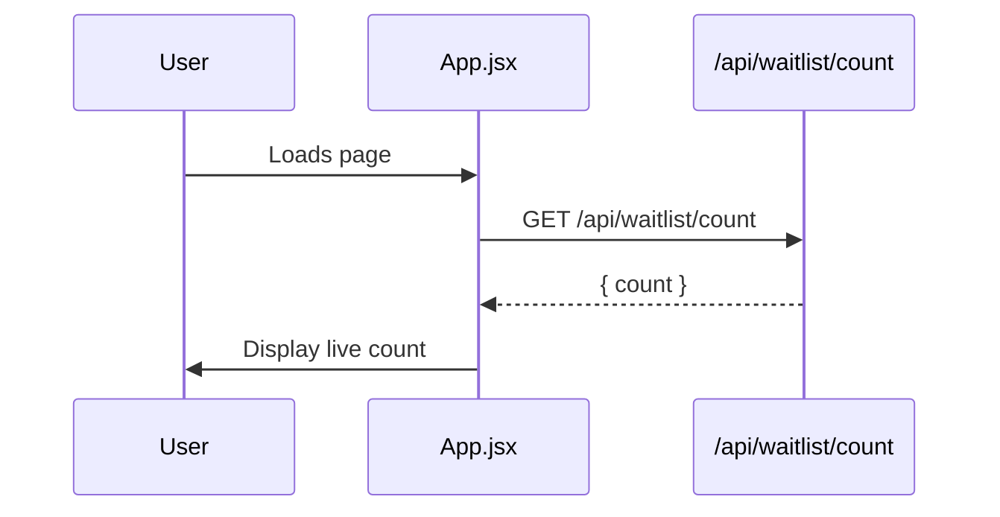
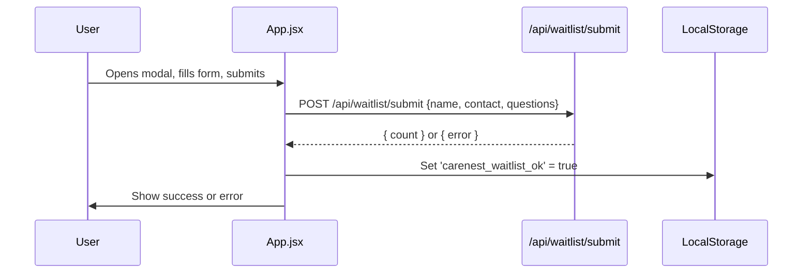

# CareNest Waitlist Module Documentation

## Introduction

The **CareNest Waitlist module** powers the public-facing landing page and waitlist intent-capture system for the CareNest platform. It is designed to:
- Present the CareNest value proposition to prospective users (families of aging parents in India)
- Capture early interest and feedback via a secure, user-friendly waitlist form
- Display real-time waitlist statistics and reinforce trust through transparent UI/UX

This module is implemented as a React single-page application (SPA) and interacts with backend APIs to manage waitlist submissions and display live metrics.

---

## Core Functionality

- **Landing Page UI**: Presents CareNest's mission, product features, and early access offer in a clear, compelling format.
- **Waitlist Modal**: Securely collects user information (name, email, feedback) and submits it to the backend.
- **Live Waitlist Count**: Fetches and displays the current number of families on the waitlist.
- **Submission State Management**: Prevents duplicate submissions using local storage and provides real-time feedback on submission status.
- **Error Handling**: Displays server and network errors to the user in a user-friendly manner.

---

## Architecture Overview

```mermaid
graph TD
    A[User] -- interacts with --> B[CareNest Waitlist SPA (App.jsx)]
    B -- fetches count --> C[/api/waitlist/count]
    B -- submits form --> D[/api/waitlist/submit]
    B -- stores flag --> E[LocalStorage]
    C & D -- handled by --> F[Backend Waitlist API]
    F -- (see) --> G[backend-waitlist.md]
```

- **App.jsx** is the main entry point and orchestrates all UI and API interactions.
- The frontend communicates with backend endpoints for waitlist operations (see [backend-waitlist.md]).
- LocalStorage is used to persist submission state per user/device.

---

## Component Relationships & Data Flow

```mermaid
flowchart TD
    subgraph React SPA
        App[App.jsx]
        Modal[Waitlist Modal]
        Banner[Announcement Banner]
        CTA[Bottom CTA]
    end
    App -- opens/closes --> Modal
    App -- updates count --> Banner
    App -- disables CTA if submitted --> CTA
    Modal -- submits form --> API[/api/waitlist/submit]
    App -- fetches count --> API2[/api/waitlist/count]
    App -- sets/gets flag --> LocalStorage
```

- **App.jsx** manages all state and passes props to UI components.
- The modal is conditionally rendered based on user interaction and submission state.
- API calls are made directly from App.jsx handlers.

---

## Process Flows

### 1. Waitlist Count Fetch


### 2. Waitlist Submission


---

## Key Functions & Handlers

- **handleOpenModal**: Opens the waitlist modal if the user hasn't already submitted.
- **handleFormSubmit**: Handles form submission, sends data to the backend, updates UI and local storage, and manages error/success states.
- **fetchWaitlistCount**: Fetches the current waitlist count from the backend API.

---

## Integration Points

- **Backend Waitlist API**: All data persistence and validation are handled by the backend. See [backend-waitlist.md] for API contract and server-side logic.
- **Styling & Icons**: Uses local CSS and Lucide React icons for UI consistency.

---

## Extending & Maintaining

- To change the waitlist form fields or validation, update the form state and handlers in `App.jsx`.
- To modify backend endpoints or error handling, coordinate with the backend team (see [backend-waitlist.md]).
- For UI/UX changes, update the relevant JSX and CSS files.

---

## References
- [backend-waitlist.md]: Backend API and data model for waitlist operations
- [carenest-platform.md]: Overview of the CareNest platform architecture

